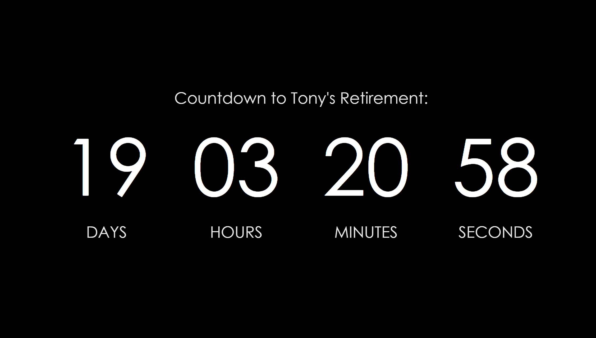

Countdown is a simple web based countdown timer. Date is entered in format YYYY-MM-DD hh:mm:ss. Time to date is
displayed in days, hours, minutes, seconds.

Countdown animation made possible by [javascript](https://stackoverflow
.com/questions/41145086/js-countdown-timer-to-a-specific-date).

